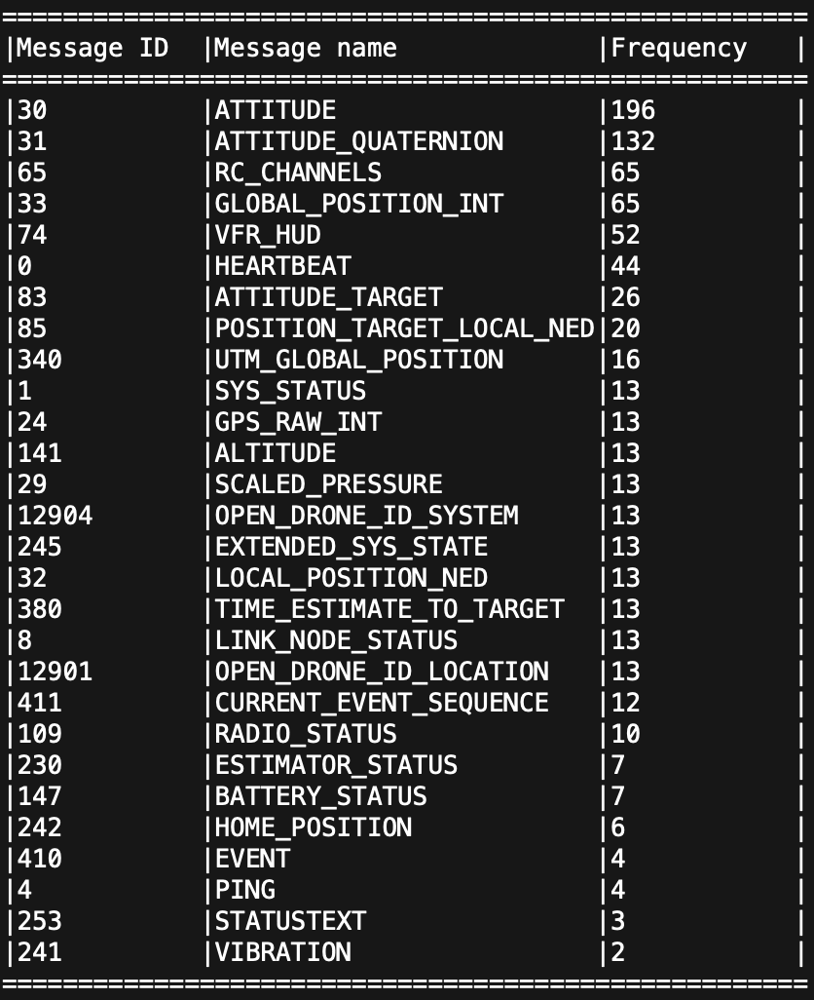

# wireshark

This directory contains the MAVLink dissector for Wireshark with statistical analysis capabilities added.

In please see the MAVLink documentation [here](https://mavlink.io/en/guide/wireshark.html) for instructions on how to generte the `mavlink_2_common.lua` plugin. Once generated, it should be placed in the the directory `Users/user/.local/lib/wireshark/plugins` if working on macOS along with the python script `plotter.py`.

Note: The statistical analysis portion is still a work-in-progress and has been completed for all of the messages captured thus far.

## Contents

* `mavlink_2_common.lua` is a Wireshark plugin which contains a dissector for the MAVLink protocol
* `plotter.py` is a python script that plots a histogram of number of occorances versus message type for all messages in a capture

## Usage

* Update the `dir` variable in `mavlink_2_common.lua` to reflect your own username
* Launch Wireshark by typing `wireshark` in the command line
* Open a PCAP file contaning MAVLink messages or start a packet capture
* After opening the PCAP file or upon completion of the packet capture, navigate to `Statistics/MAVLink Analysis` in the Wireshark GUI to initiate the statistical analysis

## Statistical analysis

* Break-down of number of occurances of each message type:
  
* Break-down of the number of occurances of each message length (in bytes):
  
* Bar graph of the number of occurances of each message type:
  
* Analysis on each field part of the MAVLink header:
  
* For each message type, provides an analysis of each field of the message:
  
  
  
  
  
